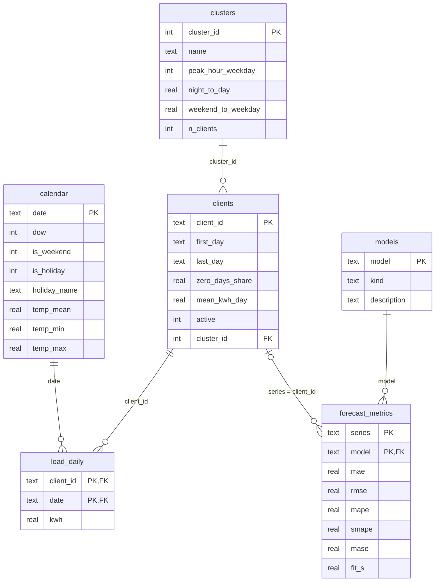

# ER diagram of the SQLite database

Schema: `sql/schema.sql`. Picture: `results/figures/09_er.png` (drawn from the database, `python main.py db`).

```mermaid
erDiagram
    clusters ||--o{ clients : "cluster_id"
    clients  ||--o{ load_daily : "client_id"
    calendar ||--o{ load_daily : "date"
    models   ||--o{ forecast_metrics : "model"
    clients  |o--o{ forecast_metrics : "series = client_id"

    clusters {
        int cluster_id PK
        text name
        int peak_hour_weekday
        real night_to_day
        real weekend_to_weekday
        int n_clients
    }
    clients {
        text client_id PK
        text first_day
        text last_day
        real zero_days_share
        real mean_kwh_day
        int active
        int cluster_id FK
    }
    calendar {
        text date PK
        int dow
        int is_weekend
        int is_holiday
        text holiday_name
        real temp_mean
        real temp_min
        real temp_max
    }
    load_daily {
        text client_id PK, FK
        text date PK, FK
        real kwh
    }
    models {
        text model PK
        text kind
        text description
    }
    forecast_metrics {
        text series PK
        text model PK, FK
        real mae
        real rmse
        real mape
        real smape
        real mase
        real fit_s
    }
```
